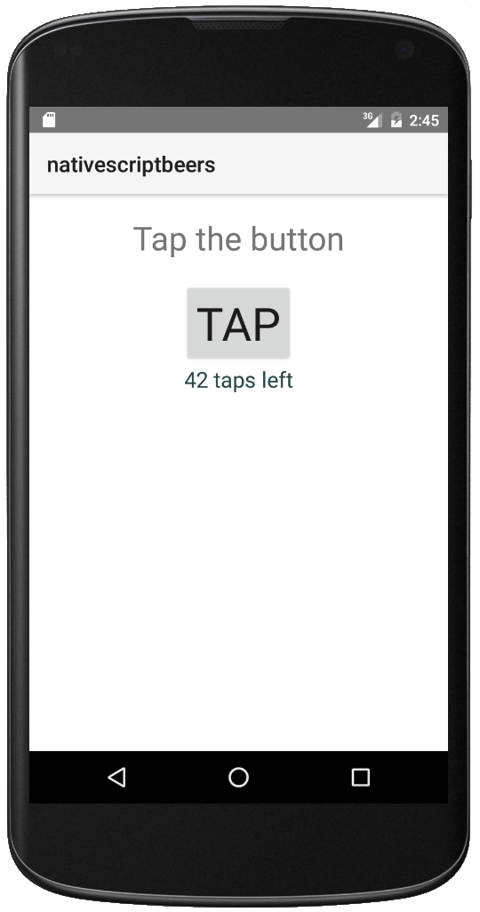

**NativeScript Beers** is a tutorial of the [Beer Tutorials](http://www.beer-tutorials.org) series.
In this tutorial we will create a simple app that queries a beer catalog and displays a list of beers.

## Getting Started

Install [NodeJS](https://nodejs.org/) and then using the node package manager (npm), install native script.

```
npm install -g nativescript
```

After installing native script, create a new project called `nativescript-beers`.

```
tns create nativescript-beers
```

Navigate to the project directory and add the mobile development platform.

```
tns platform add android
```

Run the application on the Android emulator.

```
tns run android --emulator
```

> Note: To run the application in the Android emulator, you need to have the Android SDK
> installed and configured on your computer.
> The easiest way to do it is to install [Android Studio](http://developer.android.com/tools/studio/index.html)
> for your platform.



## Project Structures


    .
    └── nativescript-beers
        ├── app
        │   ├── App_Resources
        │   │   ├── Android
        │   │   └── iOS
        │   ├── shared
        │   │   └── ...
        │   ├── views
        │   │   └── login
        │   │       ├── login.js
        │   │       └── login.xml
        │   ├── app.css
        │   ├── app.js
        │   └── ...
        ├── node_modules
        │   └── tns-core-modules
        ├── package.json
        └── platforms
            ├── android
            └── ios    
